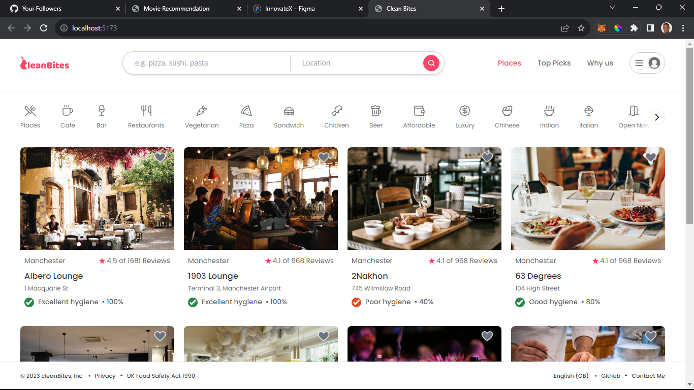

# Clean Bites - Food Places Recommendations Web Application

## Introduction

According to the UK Food Standards Agency (FSA), there are nearly 2.4 million cases of food poisoning in the UK each year. Clean Bites is a web application designed to provide users with reliable restaurant recommendations while prioritizing food safety and hygiene..

## Features

1. **Data:**  So far I started off with over 20,000 restaurants in London and I hope to include other cities as well. This data is obtained by scraping publicly available data from Google Maps and cleaning it with python.

2. **Official Health and Hygiene Score:** This score is a critical indicator of the cleanliness and safety of a dining establishment, helping customers make informed choices.

3. **Google Places Detail Enrichment:** I've enriched each place by adding data from Google Places API.

4. **Typescript, React, Python, Django, PostgreSQL:** Clean Bites is built using Typescript and React for the frontend, Python and Django for the backend, and PostgreSQL for database.

## Work in Progress

Clean Bites is an ongoing project. Heres whats next:

**Place Details**: the place detail page is still a WIP

**similar places Recommendation**: show users a list of place similar to what they're looking at.

**Text Search and Autocomplete**: Adding a text search feature to allow users to find restaurants based on specific keywords or criteria.

**Auth**: Working on user Authentication.
